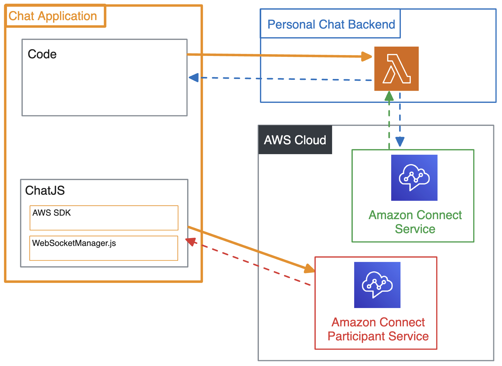
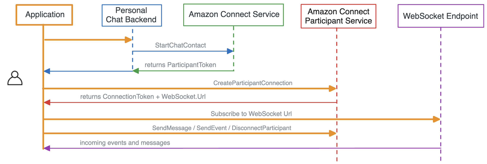

# Building a Chat application for Amazon Connect with ChatJS

## Overview

This guide will walk through how to use a personal chat backend and Amazon Connect public APIs to build a chat application, using the ChatJS library.

[ChatJS](https://www.npmjs.com/package/amazon-connect-chatjs) is a JavaScript library with light wrapper around the AWS-SDK. This has built in logic to handle WebSocket connections and retry logic.

> If you wish to build an application with the [v3 JavaScript AWS SDK](https://docs.aws.amazon.com/AWSJavaScriptSDK/v3/latest/Package/-aws-sdk-client-connectparticipant/) directly, please refer to ["Building a Chat application for Amazon Connect with AWS SDK"](https://github.com/spenlep-amzn/amazon-connect-chat-application-aws-sdk-guide)



## Sequence of API Calls



1. **Initiate a chat:** make request to your personal chat backend, which calls the [StartChatContact](https://docs.aws.amazon.com/connect/latest/APIReference/API_StartChatContact.html) SigV4 API
2. **Connect to a chat session:** make a [CreateParticipantConnection](https://docs.aws.amazon.com/connect-participant/latest/APIReference/API_CreateParticipantConnection.html) request with ChatJS
3. **Subscribe to websocket:** (handled by ChatJS) ~~use the ConnectionToken and WebSocket URL provided~~
4. **Send chat events:** make requests to [Amazon Connect Participant Service](https://docs.aws.amazon.com/connect-participant/latest/APIReference/API_Operations.html) APIs with ChatJS

## Prerequisites

1. Create an Amazon Connect Instance [[_guide_](https://docs.aws.amazon.com/connect/latest/adminguide/amazon-connect-instances.html)]
2. Create an Amazon Connect Contact Flow, ready to receive chat contacts. [[_guide_](https://docs.aws.amazon.com/connect/latest/adminguide/chat.html)]

    * Find the instanceId [[_guide_](https://docs.aws.amazon.com/connect/latest/adminguide/find-instance-arn.html)]
    * Find the contactFlowId for the "_Sample Inbound Flow (First Contact)_“ [[_guide_](https://docs.aws.amazon.com/connect/latest/adminguide/find-contact-flow-id.html)]

1. Deploy a custom Amazon Connect Chat backend. [[sample CloudFormation stack](https://github.com/amazon-connect/amazon-connect-chat-ui-examples/tree/master/cloudformationTemplates/startChatContactAPI)]

## High-Level guide

### Install ChatJS

```sh
$ npm install amazon-connect-chatjs
```

```js
import "amazon-connect-chatjs"; 

// imports the global "connect" class
connect.ChatSession.create({ /* ... */ });
```

### Initiate a chat

Since [StartChatContact](https://docs.aws.amazon.com/connect/latest/APIReference/API_StartChatContact.html) is a [SigV4 API](https://docs.aws.amazon.com/IAM/latest/UserGuide/reference_aws-signing.html), your application will first make a call to your personal chat backend. If you deploy the [sample startChatContactAPI CloudFormation](https://github.com/amazon-connect/amazon-connect-chat-ui-examples/tree/master/cloudformationTemplates/startChatContactAPI) stack, make a request to the API Gateway endpoint. This will return the ParticipantToken used for the rest of the chat session. 

```js
// Your chat application
// Example code making request to personal chat backend

const ENDPOINT_URL = "<url-to-personal-chat-backend>";

const startChatRequestBody = {
   ContactFlowId: "<REPLACE_ME>",
   InstanceId: "<REPLACE_ME>",
   ParticipantDetails: {
         DisplayName: "John Doe"
   }
};

fetch(ENDPOINT_URL, {
  "POST",
  headers: { 'Content-Type': 'application/json' },
  body: JSON.stringify(startChatRequestBody), 
})
  .then(response => response.json())
  .then(data => {
    console.log('Lambda response:', data); // { "ContactId": "string", "ContinuedFromContactId": "string", "ParticipantId": "string", "ParticipantToken": "string" }
  })
  .catch(error => {
    console.error('API error:', error);
  });
```

Your personal chat backend can use the AWS SDK to make the StartChatContact request, and return the response to your chat application. Here is an example lambda function for this use case:

```js
// AWS SDK v3 (JavaScript) example
// Lambda code to make StartChatContact request

// Source: https://github.com/amazon-connect/amazon-connect-chat-ui-examples/blob/master/cloudformationTemplates/startChatContactAPI/js/startChatContact.js

const { ConnectClient, StartChatContactCommand } = require("@aws-sdk/client-connect");
const client = new ConnectClient({ region: process.env.REGION });

exports.handler = (event, context, callback) => {
    const body = JSON.parse(event["body"]);
    const startChatRequest = {
        "InstanceId": body["InstanceId"],
        "ContactFlowId": body["ContactFlowId"],
        "ParticipantDetails": {
            "DisplayName": body["ParticipantDetails"]["DisplayName"]
        },
    };
 
    const command = new StartChatContactCommand(startChatRequest);

    try {
        const response = await client.send(command);
        
        console.log("Start chat succeeded with the response: " + JSON.stringify(response.data));
        callback({ 200, body: JSON.stringify(response.data) }) // // { "ContactId": "string", "ContinuedFromContactId": "string", "ParticipantId": "string", "ParticipantToken": "string" }
    } catch (error) {
        console.error("Error starting chat contact:", error);
    }
};
```

### Connect to a chat session

Connect to the ongoing chat session using the [CreateParticipantConnection](https://docs.aws.amazon.com/connect-participant/latest/APIReference/API_CreateParticipantConnection.html) public API, and pass in the values of the StartChatContact response. This returns ConnectionToken and WebSocket URL

```js
import "amazon-connect-chatjs"; 

const chatSession = connect.ChatSession.create({
  chatDetails: { 
    contactId: "<REPLACE_ME>",
    participantId: "<REPLACE_ME>",
    participantToken: "<REPLACE_ME>",
  },
  options: { // optional
    region: REGION, // optional
  },
  type: "CUSTOMER", 
});

await chatSession.connect();
```

### Send chat events

Make calls to the [Amazon Connect Participant Service](https://docs.aws.amazon.com/connect-participant/latest/APIReference/API_Operations.html) APIs for the ongoing chat, using the ConnectionToken.

####  Sending Messages

Send a message using the [SendMessage](https://docs.aws.amazon.com/connect-participant/latest/APIReference/API_SendMessage.html) API

```js
import "amazon-connect-chatjs";

await chatSession.sendMessage({
  contentType: "text/plain", // Documentation: https://docs.aws.amazon.com/connect-participant/latest/APIReference/API_SendMessage.html#connectparticipant-SendMessage-request-ContentType
  message: "Hello World!"
});
```

####  Triggering events

Send more chat events using the [SendEvent](https://docs.aws.amazon.com/connect-participant/latest/APIReference/API_SendEvent.html) API

```js
import "amazon-connect-chatjs";

const awsSdkResponse = await chatSession.sendEvent({
  contentType: "application/vnd.amazonaws.connect.event.typing" // Documentation: https://docs.aws.amazon.com/connect-participant/latest/APIReference/API_SendEvent.html#connectparticipant-SendEvent-request-ContentType
});
const { AbsoluteTime, Id } = awsSdkResponse.data;
```

#### Load chat transcript

Fetch the chat transcript using the [GetTranscript](https://docs.aws.amazon.com/connect-participant/latest/APIReference/API_GetTranscript.html) API (uses ConnectionToken)

```js
import "amazon-connect-chatjs";

const awsSdkResponse = await chatSession.getTranscript({
  maxResults: 100,
  sortOrder: "ASCENDING"
});
const { InitialContactId, NextToken, Transcript } = awsSdkResponse.data;
```


####  Handling incoming WebSocket events

Add `chatSession` event listeners to handle incoming WebSocket events. Refer to [ChatJS Documentation](https://github.com/amazon-connect/amazon-connect-chatjs) for complete list

```js
await chatSession.connect();

// ...

chatSession.onMessage(event => {
  const { chatDetails, data } = event;
  switch (data.ContentType) {
    // ...
  }
});

chatSession.onConnectionBroken(event => {
  const { chatDetails } = event;
  // ...
});

chatSession.onEnded(event => {
  const { chatDetails, data } = event;
  // ...
});

chatSession.onTyping(event => {
  const { chatDetails, data } = event;
  if (data.ParticipantRole === "AGENT") {
    // ...
  }
});
```

### End a chat

End the ongoing chat session with the [DisconnectParticipant](https://docs.aws.amazon.com/connect-participant/latest/APIReference/API_DisconnectParticipant.html) API

```js
import "amazon-connect-chatjs";

await chatSession.disconnectParticipant();
```


